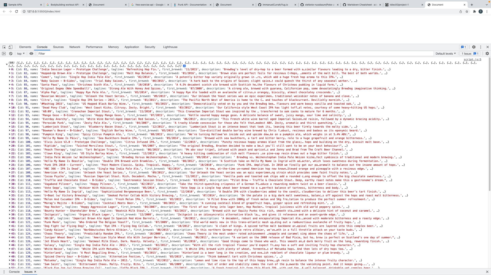
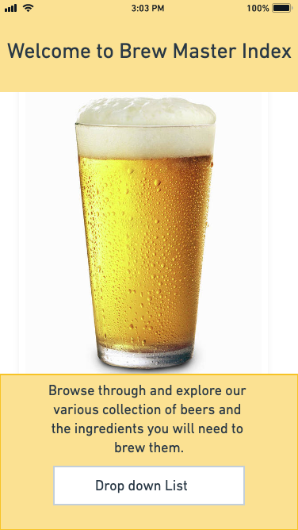
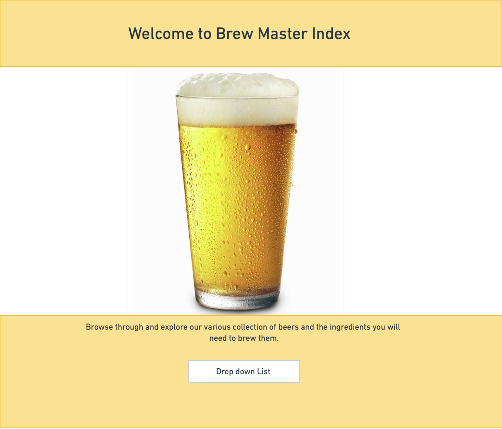
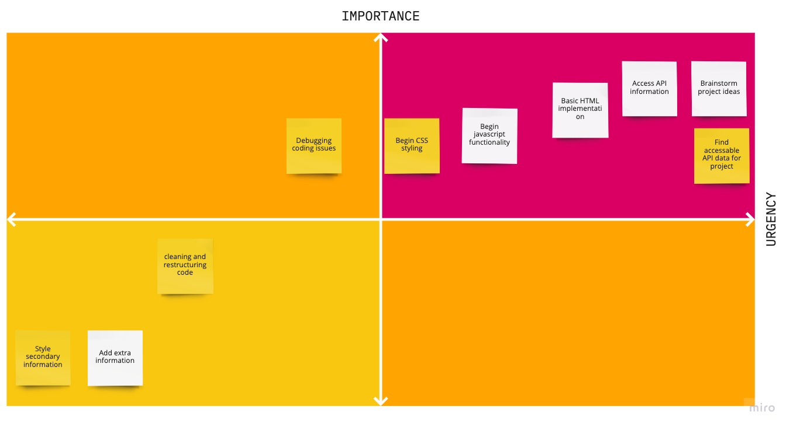

# Project Overview

## Project Name

Brew Master Index

## Project Description

My project will be a simple database that consists of random beers and recipes for beginners looking to brew batches of beer. The site will consist of a drop down menu with a list of beers. The beer choice will include a description and the ingredients required to brew it.

## API and Data Sample



## Wireframes
Wire frame for phone screen size



Wire frame for phone desktop screen size


### MVP/PostMVP


#### MVP 

* Access data from api.
* Drop down menu with the list of beer names.
* Generate beer name, description, and ingredient information underneath dropdown menu.
* Style page with css flexbox.
* Compatability with phone and desktop screen sizes.

#### PostMVP  

* Add favorites tab that saves choices of beers
* Add more information including abv, brewer tips, mash temp, and fermentation temp.
* Style new elements of page (favorites list, additional info, and favorites button)
* Add in functionality for tablet screen size.


## Project Schedule

This schedule will be used to keep track of your progress throughout the week and align with our expectations.  

You are **responsible** for scheduling time with your squad to seek approval for each deliverable by the end of the corresponding day, excluding `Saturday` and `Sunday`.

|  Day | Deliverable | Status
|---|---| ---|
|Dec 10-12| Prompt / Wireframes / Priority Matrix / Timeframes | Complete
|Dec 13| Project Approval | Incomplete
|Dec 13| Core Application Structure (HTML, CSS, etc.) | Incomplete
|Dec 14| Pseudocode / actual code | Incomplete
|Dec 15| Initial Clickable Model  | Incomplete
|Dec 16| MVP | Incomplete
|Dec 17| Presentations | Incomplete

## Priority Matrix



## Timeframes


| Component | Priority | Estimated Time | Time Invested | Actual Time |
| --- | :---: |  :---: | :---: | :---: |
| Basic HTML setup| H | 2.5hrs| 0.5hr |  |
| Retreive data from API | H | 2.5hrs| 1hr | |
| Incorporate API info to DOM| H | 5hrs| | |
| Create form, dropdown list, and add submit/click listener| H | 3hrs | | |
| Create dropdown menu for list of objects| H | 3hrs| | |
| Create favorites button and save information to page| M | 4hr| | |
| Debugging API information and submit/click function| M | 3hrs | | |
| Set background image, style html, and buttons/dropdown boxes| H | 3hrs| ||
| CSS flexbox styling| H | 3hrs| | |
| Media query for different size screens| H | 2.5hrs| | |
| Cleaning and refactoring code| M | 3hr| | |
| Additional information (abv, brewer tips, mash temp, and fermentation temp.)| L | 3hr| | |
| Styling of new additional information| L | 4hrs| | |
|Total:| | 41.5| | |


## Code Snippet

Use this section to include a brief code snippet of functionality that you are proud of and a brief description.  

```
function reverse(string) {
	// here is the code to reverse a string of text
}
```

## Change Log
 Use this section to document what changes were made and the reasoning behind those changes.  